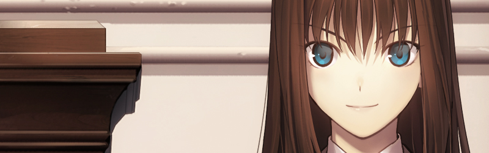
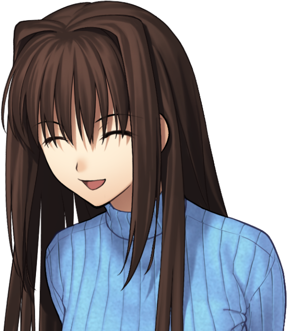

<h2 align="center">Hi! Welcome to my profile!</h2>

  I'm a <b>19-year-old</b> aspiring <b>AI engineer</b> with a love for learning. 
  While I'm currently honing my skills in various areas, my academic focus is on database management at <b>PUCRS</b> (Pontifical Catholic University of Rio Grande do Sul). 

<ul>
  <li><b>Languages:</b> I'm actively learning <b>JavaScript</b>, <b>Python</b> and <b>C++</b>, constantly pushing myself to grow in these areas.</li>
  <li><b>Mathematics:</b> In addition to coding, I enjoy delving into mathematics, aiming to excel in future entrance exams.</li>
</ul>

  When I'm not coding or studying, I unwind by watching anime or catching up with friends.

  My go-to tools for coding are <b>Visual Studio Code</b>, and for data analysis, I rely on <b>Orange Data Mining</b>. I'm constantly seeking opportunities to expand my skillset and become a well-rounded AI engineer.

